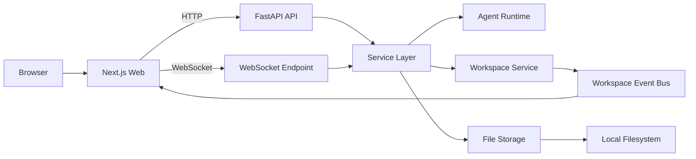

# Nexus Core

Nexus Core 是一个面向多 Agent 工作台场景的 AI Agent 开发框架。它把 Agent 管理、会话持久化、工作区协同、流式消息、权限审批和多通道接入整合成了一套可直接运行的产品骨架。

如果你想要的不是“再做一个聊天页面”，而是一套能承载 Agent Runtime、Workspace Console 和会话资产管理的基础设施，这个项目就是为这个目标设计的。

## 核心能力

- 多 Agent 工作台：每个 Agent 都有独立配置、独立工作区和独立会话集合。
- 流式实时交互：前端通过 WebSocket 接收消息增量、权限请求和工作区事件。
- 工作区协同：支持浏览、读取、编辑、创建、重命名和删除 Agent workspace 文件。
- 会话与成本持久化：消息、轮次和成本账本都会落盘，支持恢复和统计。
- Prompt 组装：系统提示词可由 `SYSTEM_PROMPT.md` 与 workspace 内的上下文文件共同构成。
- 权限治理：支持交互式权限审批，便于将工具调用纳入可控流程。
- 多入口接入：除 Web 端外，还预留了 Discord / Telegram 通道能力。

## 技术栈

### 后端

- Python 3.11+
- FastAPI
- Uvicorn / Gunicorn
- Pydantic v2
- Claude Agent SDK
- 本地文件持久化（JSON / JSONL）

### 前端

- Next.js 16
- React 19
- TypeScript 5
- Zustand
- Tailwind CSS 4
- Framer Motion

## 架构概览



默认 API 前缀为 `/agent/v1`，WebSocket 入口为 `/agent/v1/chat/ws`。

## 项目结构

```text
.
├── agent/               # FastAPI 后端、Agent Runtime、Channel、Storage、Workspace
├── web/                 # Next.js 前端工作台
├── docs/                # 技术文档与设计说明
├── deploy/              # Dockerfile / docker-compose / nginx 配置
├── env.example          # 后端环境变量模板
├── main.py              # 后端启动入口
├── makefile             # 常用开发与部署命令
└── SYSTEM_PROMPT.md     # 全局基础 system prompt（可选）
```

## 快速开始

### 1. 准备依赖

- Python 3.11 或更高版本
- Node.js 20 或更高版本
- `npm`
- 可用的 Anthropic / Claude 兼容服务凭证

### 2. 配置环境变量

后端：

```bash
cp env.example .env
```

前端：

```bash
cp web/env.example web/.env.local
```

本地开发建议把 `web/.env.local` 改成：

```bash
NEXT_PUBLIC_WS_URL=ws://localhost:8010/agent/v1/chat/ws
NEXT_PUBLIC_API_URL=http://localhost:8010/agent/v1
```

后端至少需要补充这些变量：

```bash
ANTHROPIC_AUTH_TOKEN=your_token
ANTHROPIC_MODEL=your_model
```

如果你接的是代理网关或兼容服务，也可以同时配置：

```bash
ANTHROPIC_BASE_URL=https://your-endpoint
```

### 3. 安装依赖

```bash
make install
```

这个命令会安装：

- 后端 `agent/requirements.txt`
- 前端 `web/package.json`

### 4. 启动开发环境

```bash
make dev
```

启动后可访问：

- 前端工作台: [http://localhost:3000](http://localhost:3000)
- 后端 API: [http://localhost:8010](http://localhost:8010)
- Swagger 文档: [http://localhost:8010/docs](http://localhost:8010/docs)

也可以分开启动：

```bash
make run-backend
make run-web
```

## 常用命令

```bash
make help          # 查看全部命令
make install       # 安装前后端依赖
make dev           # 同时启动前后端开发服务
make run-backend   # 仅启动后端
make run-web       # 仅启动前端
make build         # 构建 Docker 镜像
make start         # 启动 Docker 部署
make logs          # 查看 Docker 日志
make stop          # 停止 Docker 部署
```

## 关键配置项

### 后端 `.env`

| 变量 | 说明 |
| --- | --- |
| `ANTHROPIC_AUTH_TOKEN` | Claude / 兼容服务鉴权令牌 |
| `ANTHROPIC_BASE_URL` | 可选，自定义 API 网关地址 |
| `ANTHROPIC_MODEL` | 默认使用的模型 |
| `HOST` | 后端监听地址，默认 `0.0.0.0` |
| `PORT` | 后端端口，默认 `8010` |
| `WORKSPACE_PATH` | Agent workspace 根目录，默认 `~/.nexus-core/workspace` |
| `WEBSOCKET_ENABLED` | 是否启用 WebSocket 通道 |
| `DISCORD_ENABLED` | 是否启用 Discord 通道 |
| `TELEGRAM_ENABLED` | 是否启用 Telegram 通道 |

### 前端 `web/.env.local`

| 变量 | 说明 |
| --- | --- |
| `NEXT_PUBLIC_API_URL` | 前端调用的 HTTP API 地址 |
| `NEXT_PUBLIC_WS_URL` | 前端连接的 WebSocket 地址 |

## 数据与工作区约定

Nexus Core 默认把运行数据保存在用户目录下：

- Agent 索引：`~/.nexus-core/agents/index.json`
- Workspace 根目录：`~/.nexus-core/workspace/`
- 单个 Agent 的运行态目录：`<workspace>/.agent/`

每个新 Agent 初始化时会自动创建这些上下文文件：

- `AGENTS.md`
- `USER.md`
- `MEMORY.md`
- `RUNBOOK.md`
- `memory/README.md`

其中：

- `SYSTEM_PROMPT.md` 用于定义全局基础提示词
- `AGENTS.md` / `USER.md` / `MEMORY.md` / `RUNBOOK.md` 会参与 Agent system prompt 组装
- `.agent/` 目录保存 Agent 快照、Session 元数据、消息日志和成本账本

## API 与实时通信

### 主要 HTTP 端点

- `GET /agent/v1/agents`：获取 Agent 列表
- `POST /agent/v1/agents`：创建 Agent
- `PATCH /agent/v1/agents/{agent_id}`：更新 Agent 配置
- `GET /agent/v1/agents/{agent_id}/workspace/files`：获取 workspace 文件树
- `GET /agent/v1/sessions`：获取会话列表
- `POST /agent/v1/sessions`：创建会话
- `GET /agent/v1/sessions/{session_key}/messages`：获取消息历史
- `GET /agent/v1/sessions/{session_key}/cost/summary`：获取会话成本统计

### WebSocket

WebSocket 地址：

```text
ws://localhost:8010/agent/v1/chat/ws
```

主要用于：

- 流式消息输出
- 中断当前运行
- 权限请求与审批响应
- workspace 文件事件订阅与推送

## Docker 部署

如果你希望以容器方式启动：

```bash
make build
make start
```

默认部署形态包含：

- `nexus-core`：后端服务
- `web`：Next.js 前端
- `nginx`：反向代理，默认暴露 `80/443`

注意事项：

- `make start` 会自动检查并创建 `net` Docker network。
- `deploy/docker-compose.yml` 中前端构建参数默认写的是 `localhost`，如果部署到真实域名，需要先按实际访问地址调整 `NEXT_PUBLIC_API_URL` 和 `NEXT_PUBLIC_WS_URL`。

## 开发校验建议

提交前建议至少执行：

```bash
python -m py_compile $(rg --files agent -g '*.py')
cd web && npm run lint
cd web && npx tsc --noEmit
```

另外建议手动验证这些关键流程：

- Agent 创建、编辑、删除
- Session 创建、切换、删除
- 消息发送、中断、恢复
- Workspace 文件编辑与实时刷新
- 权限审批弹窗与结果回传

## 文档

- 详细技术设计：`docs/nexus-core-technical-doc.md`
- 变更记录：`CHANGELOG.md`

## 适合的使用场景

- 搭建自定义多 Agent 开发工作台
- 给 Claude Agent SDK 增加可视化管理界面
- 把 Agent 与本地 workspace、上下文文件、持久化能力整合到一个系统
- 作为 Discord / Telegram / Web 多入口共享同一对话编排链路的基础设施

## License

当前仓库未声明单独 License。如需开源或对外分发，建议补充明确的授权协议。
