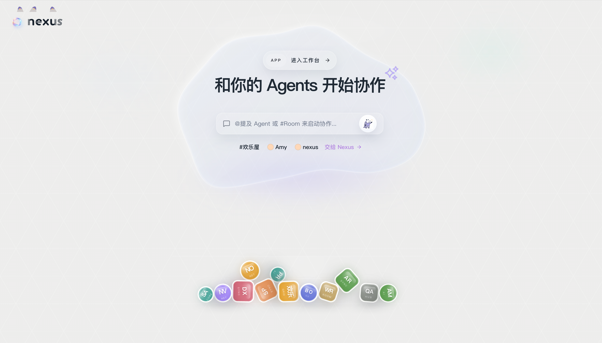

<div align="center">

# Nexus

[](https://go.dev/)
[](https://nodejs.org/)
[](https://www.apache.org/licenses/LICENSE-2.0)

<p align="center">
  <strong>中文</strong> | <a href="./README.md">English</a>
</p>

</div>

---

<div align="center">

</div>

---

在 Nexus 里，AI 智能体像同事一样工作。

它们有名字，有自己的工作区，记得上次聊到哪里。你可以建一个房间，把几个智能体拉进来，看它们围绕一个问题讨论、分工，把结果整理出来。也可以只和其中一个对话，让它专心完成一件事。

---

## 特性

- 智能体有独立的身份、工作区和技能配置，记忆跨会话保留，工作产出自主沉淀
- Room 里多个智能体可以和你一起讨论、分工，支持 @ 提及、私域动作、定向回复、多线程推进
- 通过 heartbeat、定时任务和环境感知，智能体可以按计划主动推进，不只是等待响应
- Skill 扩展能力，Connector 接入外部服务（GitHub、Gmail、LinkedIn、X、Instagram、Shopify）
- 支持 Web 界面、Linux / Windows 服务端部署、macOS 原生桌面应用

---

## 快速开始

### 安装 Claude Code

Nexus 当前通过 `nexus-agent-sdk-bridge` 启动 Claude Code 来运行 Agent，因此运行后端的机器需要先安装 Claude Code，并确保 `claude` 在 `PATH` 中可用。

```bash
# macOS / Linux / WSL
curl -fsSL https://claude.ai/install.sh | bash

# 也可以使用 npm 安装
npm install -g @anthropic-ai/claude-code
```

Windows PowerShell：

```powershell
irm https://claude.ai/install.ps1 | iex
```

也可以使用 WinGet：

```powershell
winget install Anthropic.ClaudeCode
```

安装后先运行一次 `claude` 并完成登录。原生 Windows 环境建议安装 Git for Windows，这样 Claude Code 可以使用 Bash 工具；没有 Git for Windows 时会回退到 PowerShell。最新平台安装方式以 [Claude Code 官方安装文档](https://code.claude.com/docs/en/getting-started) 为准。

### 使用发布包

```bash
# 解压（以 Linux x86_64 为例）
tar -xzf nexus-v0.1.3-linux-amd64.tar.gz
cd nexus-v0.1.3-linux-amd64

# 初始化数据库，创建管理员账号
./bin/nexus-migrate up
printf '%s\n' 'your-password' | ./bin/nexusctl auth init-owner --username admin --password-stdin

# 启动
./run-nexus
```

打开 `http://localhost:8010`，登录后即可开始。

发布包升级时，在 Web UI 的设置页打开新版本下载入口，下载对应平台的发布包；停止 Nexus 后替换解压目录，再执行迁移并重新启动。

### Docker 部署

```bash
# 构建镜像
docker build -f deploy/Dockerfile -t nexus:latest .

# 启动容器
docker run -d \
  -p 8010:8010 \
  -v nexus-data:/home/agent/.nexus \
  --name nexus \
  nexus:latest
```

初始化管理员账号：

```bash
printf '%s\n' 'your-password' | docker exec -i nexus nexusctl auth init-owner --username admin --password-stdin
```

### 本地开发

```bash
make install
make dev
```

后端在 `http://localhost:8010` 启动，前端开发服务在 `http://localhost:3000` 启动，两个进程独立运行，热更新各自生效。

需要：Go 1.26+、Node.js 22+、pnpm 9.15+，并确保 Claude Code 可以通过 `claude` 命令访问。

---

## 核心概念

| 概念 | 说明 |
|------|------|
| **Agent** | 系统成员。有身份、工作区、技能，记忆跨会话保留 |
| **Room** | 协作容器。Agent 和人在共享上下文里一起工作 |
| **DM** | 与单个 Agent 的持续会话，运行状态完整保留 |
| **Workspace** | 每个 Agent 独立的文件目录，自主沉淀工作产出 |
| **Skill** | 安装到 Agent 的能力扩展，内置或自定义均可 |
| **Connector** | 管理 OAuth 应用配置与外部服务账号连接 |
| **主智能体** | 系统保留 Agent，负责默认入口与平台级编排 |

---

## 内置技能

| 技能 | 功能 |
|------|------|
| `imagegen` | 调用图片生成 Provider，结果保存到工作区 |
| `nexus-manager` | 让 Agent 操作 Nexus 的智能体、房间、会话和工作区 |
| `room-playbook` | 为房间协作提供固定规则和操作指引 |
| `scheduled-task-manager` | 管理定时任务与 heartbeat 类持续跟进任务 |
| `memory-manager` | 按约定维护项目记忆文件 |

---

## 许可证

Apache License 2.0 · [LICENSE](./LICENSE)
