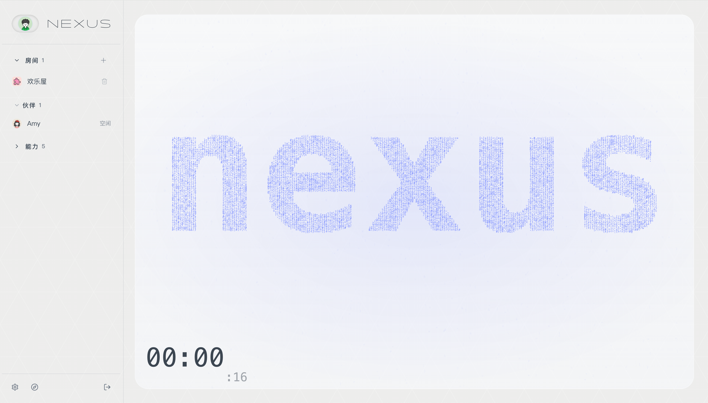

<div align="center">

# Nexus

Agent 与人平等协作的工作台

[](https://go.dev/)
[](https://nodejs.org/)
[](https://www.apache.org/licenses/LICENSE-2.0)

<p align="center">
  <strong>中文</strong> | <a href="./README.md">English</a>
</p>

</div>

---

<div align="center">

</div>

---

Nexus 是一个可以自托管的多智能体工作台。

在 Nexus 里，每个 Agent 都是真正的成员：有自己的身份、工作区和跨会话记忆，能自主沉淀、主动推进，也能在 Room 里与其他 Agent 和人一起工作。它不只是一个对话界面——你可以看到 Agent 正在做什么，随时介入，完整掌控运行状态和权限边界。

---

## 核心能力

**Agent 是成员，不是工具**
每个 Agent 有独立的身份、工作区和技能配置。记忆跨会话保留，工作区文件自主沉淀，不是一次性的调用。

**Room 协作**
Agent 和人在共享的 Room 里平等参与。@提及、私域动作、多线程推进——多个 Agent 可以围绕同一件事分工协作，结果汇聚在同一条线索里。

**自主运行**
支持 heartbeat、定时任务和环境感知。Agent 可以主动推进任务，而不只是等待被叫到。

**能力可扩展**
通过 Skill 和 Connector 扩展 Agent 的感知与行动边界。图片生成、记忆管理、外部服务接入——按需安装，随时可用。

---

## 快速开始

### 使用发布包

```bash
# 解压（以 Linux x86_64 为例）
tar -xzf nexus-v0.1.3-linux-amd64.tar.gz
cd nexus-v0.1.3-linux-amd64

# 初始化数据库，创建管理员账号
./bin/nexus-migrate up
printf '%s\n' 'your-password' | ./bin/nexusctl auth init-owner --username admin --password-stdin

# 启动
./run-nexus
```

打开 `http://localhost:8010`，登录后即可开始。

### Docker 部署

```bash
# 构建镜像
docker build -t nexus:latest .

# 启动容器
docker run -d \
  -p 8010:8010 \
  -v nexus-data:/data \
  --name nexus \
  nexus:latest
```

初始化管理员账号：

```bash
docker exec nexus ./bin/nexusctl auth init-owner --username admin --password-stdin
```

### 本地开发

```bash
make install
make dev
```

后端在 `http://localhost:8010` 启动，前端开发服务在 `http://localhost:3000` 启动，两个过程独立运行，热更新各自生效。

需要：Go 1.26+、Node.js 22+、pnpm 9.15+

---

## 核心概念

| 概念 | 说明 |
|------|------|
| **Agent** | 系统成员。有身份、工作区、技能，记忆跨会话保留 |
| **Room** | 协作容器。Agent 和人在共享上下文里一起工作 |
| **DM** | 与单个 Agent 的持续会话，运行状态完整保留 |
| **Workspace** | 每个 Agent 独立的文件目录，自主沉淀工作产出 |
| **Skill** | 安装到 Agent 的能力扩展，内置或自定义均可 |
| **Connector** | 管理 OAuth 应用配置与外部服务账号连接 |
| **主智能体** | 系统保留 Agent，负责默认入口与平台级编排 |

---

## 内置技能

| 技能 | 功能 |
|------|------|
| `imagegen` | 调用图片生成 Provider，结果保存到工作区 |
| `nexus-manager` | 让 Agent 操作 Nexus 的智能体、房间、会话和工作区 |
| `room-playbook` | 为房间协作提供固定规则和操作指引 |
| `scheduled-task-manager` | 管理定时任务与 heartbeat 类持续跟进任务 |
| `memory-manager` | 按约定维护项目记忆文件 |

---

## 许可证

Apache License 2.0 · [LICENSE](./LICENSE)
