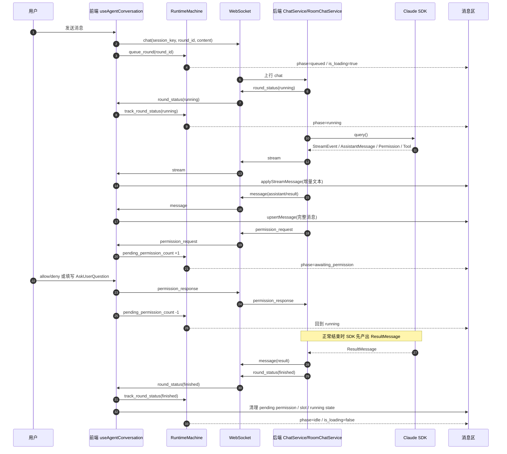
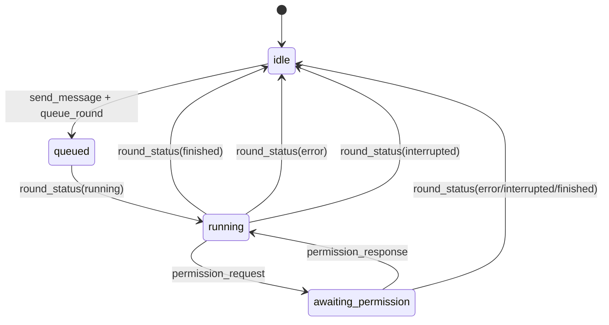

# 消息处理统一规范

## 1. 文档目的

本文档定义 Nexus 中消息处理的统一语义、展示边界和收敛方向。

这里要解决的核心问题不是“某个气泡怎么排版”，而是下面几件事：

- Claude Agent SDK 的流式事件到底表示什么
- `AssistantMessage` 和 `ResultMessage` 分别承担什么职责
- DM 与 Room 为什么不能共用一套展示逻辑
- 历史态与实时态为什么要允许不同的显示形态

后续所有消息展示改动，都必须以本文档为准推进。若当前实现与本文档不一致，以本文档定义的目标态为准收敛。

## 2. 几类概念先分开

### 2.1 StreamEvent

- 表示 Claude Agent SDK 的实时流事件
- 包括：
  - `message_start`
  - `content_block_start`
  - `content_block_delta`
  - `content_block_stop`
  - `message_delta`
  - `message_stop`
- 它负责“实时过程”，不是最终落盘消息

### 2.2 assistant turn

- 表示一次完整的 assistant 发言轮次
- 一个 `assistant.message_id` 对应一个 turn
- 一个 turn 内可能包含：
  - `thinking`
  - `tool_use`
  - `tool_result`
  - `text`

### 2.3 AssistantMessage

- 表示某个 assistant turn 的完整结果
- 它不是整条代理执行链的最终答案
- 一轮里可能有多个 `AssistantMessage`

### 2.4 ResultMessage

- 表示整条代理执行链的最终结果
- 它承担：
  - 最终正文 `result`
  - 统计信息
  - 执行终态

### 2.5 round

- 表示一次用户输入触发的一轮业务对话
- 一轮里可能包含：
  - 1 条用户消息
  - 多个 assistant turn
  - 0 或 1 条 `ResultMessage`
- round 的实时生命周期必须由后端 `round_status` 事件定义
- 正常结束链路中：
  - Claude SDK 先产出 `ResultMessage`
  - 后端再据此推送 `round_status=finished`
- 前端禁止根据以下信号自行结束 round：
  - `AssistantMessage.stop_reason`
  - `assistant.stream_status=done`
  - `tool_result`
  - `permission_response`

#### 2.5.1 实时数据流

正常 DM / 固定 Session / Room 主 round 都必须遵循同一条实时链路：



约束：

- `message(result)` 负责最终结果内容
- terminal `round_status` 负责 round 级结束语义
- 输入框是否解锁、执行态是否收口，只能由 terminal `round_status` 驱动
- `session_status` 只负责同步当前运行态与控制端归属
  - 必须包含 `running_round_ids`
  - 必须包含 `controller_client_id`
  - 必须包含 `observer_count`

#### 2.5.2 前端运行态状态机

前端只允许维护“当前处于什么阶段”的派生状态机，不允许维护第二套 round 生命周期真相源。



### 2.6 thread

- 表示单个 Agent 在某一轮中的执行细节视图
- Thread 看的是执行链，不是主时间线结果

## 3. Claude SDK 的事实模型

Claude Agent SDK 的消息语义不是“一条 assistant 一直流到结束”，而是：

```text
StreamEvent ...
AssistantMessage（turn 1）
... tool executes ...
StreamEvent ...
AssistantMessage（turn 2）
...
ResultMessage
```

一个典型顺序是：

```text
StreamEvent (message_start)
StreamEvent (content_block_start) - text block
StreamEvent (content_block_delta) - text chunks...
StreamEvent (content_block_stop)
StreamEvent (content_block_start) - tool_use block
StreamEvent (content_block_delta) - tool input chunks...
StreamEvent (content_block_stop)
StreamEvent (message_delta)
StreamEvent (message_stop)
AssistantMessage
... tool executes ...
... more streaming events for next turn ...
ResultMessage
```

结论：

- `StreamEvent` 负责实时过程
- `AssistantMessage` 负责 turn 级落盘
- `ResultMessage` 负责最终结果
- `round_status` 负责 round 级生命周期
- 前端不能把一轮里的所有 assistant 内容粗暴合并成“一条回答”

## 4. 统一中间模型

前端必须先按 turn 理解消息，再决定怎么展示。

推荐的中间模型如下：

```text
RoundView
  - user_message
  - assistant_turns[]
    - turn_id
    - blocks[]
    - stop_reason
    - status
  - result_message
```

关键规则：

- 一个 `assistant.message_id` 对应一个 turn
- 一个 turn 内的块顺序必须保持原样
- `result.parent_id` 只用于关联最终结果，不用于重排历史 turn

## 5. 展示目标

消息展示必须满足以下目标：

1. 实时对话时，用户始终能看到最新输出
2. 历史消息里，中间过程要能收起来
3. Room 主时间线只看结果，不看执行链
4. Thread 才负责展示完整执行过程
5. 没有 `result` 的场景也必须有稳定回退

## 6. Room 展示规范

Room 分成两块：

### 6.1 Room 主时间线

- 主时间线只显示最终结果
- 不显示完整执行链
- 某个 Agent 完成后，主时间线显示：
  - `result.result`
  - 对应 stats

若没有 `result`：

- 主时间线回退显示最后一个 assistant turn 的输出

### 6.2 Room Thread

- Thread 实时按顺序显示所有 assistant turn 内容
- 展示内容包括：
  - `thinking`
  - `tool_use`
  - `tool_result`
  - `assistant text`
- Thread 不显示 `ResultMessage`
- Thread 的消息源必须与 DM 实时态一致：
  - 只消费真实的 `AssistantMessage`
  - 不消费 Room 占位槽位
- Room 的权限确认默认应在 Thread 中展示
- 若 Thread 未打开，主时间线里的 pending card 也必须明确显示“等待权限确认”
- Room 前端不能把权限卡完全藏在 Thread 里，否则用户会误以为前端没收到请求

### 6.3 Room 占位规则

- Room 仍然允许 `chat_ack`
- 但 `chat_ack` 只表示“前端 pending slot”
- `chat_ack` 不是 assistant 消息
- 前端不能把 `chat_ack.msg_id` 写进 `messages`
- `chat_ack.msg_id` 也是 Room 单 Agent 停止所依赖的后端句柄
- 因此刷新恢复时，后端必须重新下发当前仍在执行的 slot
- 恢复下发的 slot 必须携带真实：
  - `round_id`
  - `status`
  - `timestamp`
- 后端输出的 assistant turn 必须与 DM 保持一致，继续使用 SDK 自己的 `message_id`
- `permission_request` 应优先按事件元信息匹配：
  - `agent_id`
  - `caused_by`
  - `message_id`
- 不能只靠工具名或命令文本猜测归属
- 主绑定链必须先按 `permission.message_id` 限定到同一条 assistant message
- 若同一条 assistant message 内有多个 `tool_use`
  - 再按 `tool_name + tool_input` 精确定位
- 禁止回退到跨 message 的签名队列匹配
- Room Thread 在 `AskUserQuestion` / 权限恢复场景下，不能再强依赖
  `permission.message_id === assistant.message_id`
  - 因为 Room 权限事件常绑定的是占位槽位 `msg_id`
  - Thread 归属应优先依赖 `agent_id + caused_by(round_id)`

### 6.4 Room 规则总结

- 主时间线 = 结果视图
- Thread = 执行视图
- 两者不混用
- 占位 = 前端状态，不是消息

## 7. DM 展示规范

DM 必须区分“实时态”和“归档态”。

### 7.1 DM 实时态

当前 round 仍在生成时：

- 不拆“最终输出区”和“调用链区”
- 所有 assistant 内容按真实顺序直接显示
- 包括：
  - `thinking`
  - `tool_use`
  - `tool_result`
  - `assistant text`

目的：

- 避免正文被塞进折叠区
- 让用户始终能看到流式输出

### 7.2 DM 归档态

当一个 round 结束后：

- 中间过程放进调用链
- 调用链默认折叠
- 调用链不包含最后一个 assistant turn
- 主区只显示：
  - `result.result`
  - 若无 `result`，则显示最后一个 assistant turn

### 7.3 DM 刷新 / 历史恢复

历史消息一律按归档态展示：

- 中间过程进调用链
- 调用链默认隐藏
- 主区只显示最终结果
- 若没有 `result`，回退到最后一个 assistant turn

### 7.4 AskUserQuestion 展示规则

- `AskUserQuestion` 是内嵌问答块，不是额外的权限确认条
- 它仍然依赖后端 `permission_request` 提供 `request_id`
- 但前端只允许通过问答块本身提交 `allow + user_answers`
- 不能在消息底部再渲染一条通用 `允许 / 拒绝` 条
- Room 主时间线若需要暴露入口，只能显示 `去回答`
  - 该动作只负责打开 Thread
  - 不能直接发送通用 `allow`
- 问题若声明多选，前端必须支持多选提交
  - 字段兼容 `multi_select / multiSelect`
  - `allow` 时必须回传完整答案数组
- 同一问题若因超时被模型重试，前端只保留最新那一条挂起请求
- `AskUserQuestion` 超时后应直接失败并结束当前交互，不应再自动补发下一条相同问题

## 8. 无 result 场景

有些终端类或特殊执行链不会产出 `ResultMessage`。

必须先明确：

- “无 `ResultMessage` 回退”只影响展示
- 不影响实时 round 是否结束
- 实时 round 的结束仍以后端 `round_status` 为唯一真值
- 正常链路里，`round_status=finished` 应由后端在收到 `ResultMessage` 后推送

这类场景统一按以下规则回退：

- Room 主时间线：显示最后一个 assistant turn
- DM 归档态：主区显示最后一个 assistant turn
- Thread：仍按完整 assistant turn 顺序显示

补充：

- 若 assistant 已明确收口为 `stream_status=done`
- 即使没有 `ResultMessage`
- 也必须视为该 Agent 子轮次已完成，不能误判成 `cancelled`

也就是说：

- `result` 是最终输出的高优先级来源
- `最后一个 assistant turn` 是统一回退来源

## 9. 展示策略矩阵

| 场景 | 主区显示 | 调用链 / 过程区 | 是否显示完整执行链 |
| --- | --- | --- | --- |
| Room 主时间线 | `result`，无则最后一个 assistant | 不显示 | 否 |

## 10. WebSocket 重连补流

### 10.1 DM / 单会话补流

- DM 断线重连后，后台任务不应停止
- 非 Room 会话的实时 envelope 需要带 `session_seq`
- 前端重连时通过 `bind_session + last_seen_session_seq` 申请补发
- 后端若缓冲区仍覆盖该游标，按序回放：
  - `message`
  - `stream`
  - `round_status`
- 若缓冲区已经不够，后端发送 `session_resync_required`
- 前端收到 `session_resync_required` 后，必须回源重拉当前会话
- `bind_session` 完成后，后端还需要额外推送一次当前 `session_status`
  - `session_status` 必须携带当前仍在运行的 `running_round_ids`
  - 它只负责“当前还有哪些 round 正在跑”
  - 不替代 durable 的 `round_status`

### 10.2 Room 补流

- Room 继续使用现有 `room_seq`
- Room 的实时回放与重拉规则不变
- `session_seq` 不替代 `room_seq`

## 11. 明确禁止的做法

以下做法应明确禁止：

### 11.1 把整轮 assistant 内容直接合并成单条最终回答

- 这会丢失 turn 边界
- 会让 DM 和 Room 相互打架

### 11.2 把所有 assistant text 都直接当成最终输出

- 中间 assistant text 应该进入过程区
- 只有最后一个 assistant turn 才有资格成为最终输出候选

### 11.3 让 Room 主时间线承担 Thread 职责

- 主时间线是结果视图
- Thread 才是执行视图

### 11.4 强制让实时态与归档态长得完全一样

- 实时态首先保证“看得到最新输出”
- 归档态首先保证“历史足够干净”
- 两者目标不同，允许不同展示

### 11.5 让前端自己推导 round 是否已经结束

- 前端不能靠 assistant 收口、权限提交、tool_result 或 slot 消失来结束 round
- 输入框解锁、执行态收口、slot 清理都必须以后端 terminal `round_status` 为准

## 12. 推荐实现边界

推荐把前端消息层收敛成 4 种显示模式：

- `dm_live`
- `dm_archived`
- `room_thread`
- `room_result`

每种模式只负责一件事：

- `dm_live`
  - 直接顺序显示当前 round 全部 assistant 内容
- `dm_archived`
  - 中间过程进调用链，最终输出留主区
- `room_thread`
  - 直接顺序显示 assistant turn，不显示 result
- `room_result`
  - 只显示 result，无 result 时回退最后一个 assistant

## 13. 规范结论

消息展示的根问题不是“块怎么拼”，而是先回答这三个问题：

1. 这是 DM 还是 Room
2. 这是实时态还是归档态
3. 这是结果视图还是执行视图

只有先把这三个问题拆清楚，消息顺序、流式显示和历史归档才会稳定。
