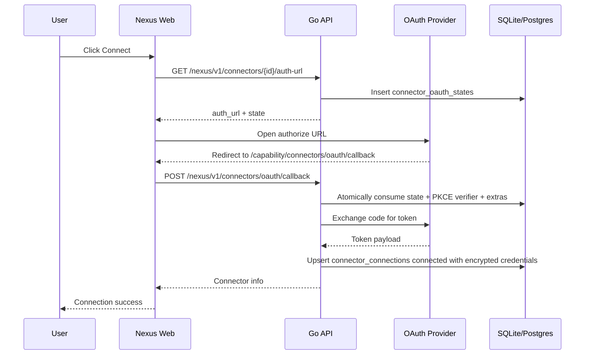
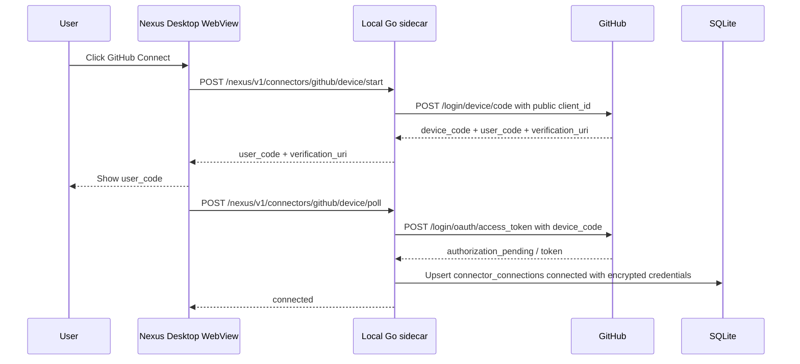

# Connector OAuth Spec

## Flow

### Web authorization code



### Desktop GitHub Device Flow



## Provider Matrix

| Provider | Authorize URL | Token URL | Scopes | PKCE | Token auth | Extras |
| --- | --- | --- | --- | --- | --- | --- |
| GitHub | `https://github.com/login/oauth/authorize` / desktop `https://github.com/login/device/code` | `https://github.com/login/oauth/access_token` | `repo read:user user:email` | No | web form `client_secret`; desktop Device Flow uses public `client_id` only | none |
| Gmail | `https://accounts.google.com/o/oauth2/v2/auth` | `https://oauth2.googleapis.com/token` | `https://www.googleapis.com/auth/gmail.modify` | Yes | form `client_secret` | none |
| LinkedIn | `https://www.linkedin.com/oauth/v2/authorization` | `https://www.linkedin.com/oauth/v2/accessToken` | `openid profile email` | Yes | form `client_secret` | none |
| X / Twitter | `https://twitter.com/i/oauth2/authorize` | `https://api.twitter.com/2/oauth2/token` | `tweet.read users.read offline.access` | Yes | HTTP Basic Auth | none |
| Instagram | `https://www.instagram.com/oauth/authorize` | `https://api.instagram.com/oauth/access_token` | `instagram_business_basic` | No | form `client_secret` | none |
| Shopify | `https://{shop}.myshopify.com/admin/oauth/authorize` | `https://{shop}.myshopify.com/admin/oauth/access_token` | `read_products read_orders read_customers` | No | form `client_secret` | `shop` |

## Redirect URI Registration

Register this exact local callback URI in each provider developer portal:

```text
http://localhost:3000/capability/connectors/oauth/callback
```

GitHub: create an OAuth App under Developer settings and set Authorization callback URL.

GitHub desktop: enable Device Flow on the OAuth App and expose only the public Client ID through `NEXUS_DESKTOP_GITHUB_CLIENT_ID` or GitHub Actions variable `NEXUS_DESKTOP_GITHUB_CLIENT_ID`.

Google: create a Web application OAuth client under APIs & Services, add the callback as an authorized redirect URI, and add the Gmail scope on the consent screen.

LinkedIn: create an app, enable "Sign In with LinkedIn using OpenID Connect", and add the callback on the Auth tab.

X / Twitter: enable OAuth 2.0 user authentication, choose Web App / confidential client, and add the callback URI.

Instagram: configure Instagram Login or Basic Display for a Business app and add the callback as a valid OAuth redirect URI.

Shopify: create a public app in the Partner dashboard and add the callback under allowed redirection URLs. Users enter only the shop subdomain, for example `nexus-dev`.

## Security Invariants

- OAuth state rows are consumed with `DELETE ... RETURNING` before token exchange, so the same state cannot be reused after the callback starts.
- State expires after `CONNECTOR_OAUTH_STATE_TTL_SECONDS`, default 600 seconds.
- Redirect URIs must match `CONNECTOR_OAUTH_ALLOWED_ORIGINS` by scheme, host, and path prefix. The default allows local web development at `http://localhost:3000`.
- Only provider-declared extra keys are persisted in `extra_json`; unknown query parameters are ignored.
- Connector credentials are encrypted with AES-GCM into `connector_connections.credentials_encrypted` when `CONNECTOR_CREDENTIALS_KEY` is configured. The key must be a 32-byte base64 value.
- Desktop GitHub packages only `CONNECTOR_GITHUB_CLIENT_ID`. `client_secret` must not be embedded in `.app` resources, Windows resources, zip, DMG, or installer assets.

## OAuth client configuration

The frontend does not provide OAuth App self-service configuration. Connector cards and detail dialogs only use `is_configured` from the backend to decide whether the user can start authorization.

Credential resolution order:

1. Deployment-level `CONNECTOR_*_CLIENT_ID` / `CONNECTOR_*_CLIENT_SECRET` environment config.
2. Desktop GitHub package config with public `CONNECTOR_GITHUB_CLIENT_ID` for Device Flow.

If the backend reports `is_configured=false`, the frontend shows a backend-not-configured state and does not expose a form for users to enter OAuth Client ID or Client Secret.

## Troubleshooting

- `OAuth state 无效或已过期`: the authorization attempt is missing, already used, or older than 10 minutes. Start Connect again.
- `redirect_uri_mismatch`: the URI passed to Nexus must exactly match the URI registered in the provider portal.
- `invalid_request` with PKCE providers: check that the provider supports S256 PKCE and that the callback is completing against the same Nexus backend that created the state.
- Shopify `shop 参数缺失`: enter the myshopify.com subdomain before opening the authorize page.

## Agent Runtime 集成

已连接 connector 会以 `nexus_connectors` SDK MCP server 注入 chat / room runtime。工具清单：

- `connector_list`: 无参数，返回当前用户已连接 connector 的 `connector_id`、`auth_type`、`api_base_url`。
- `connector_call`: 通用 REST 代理，输入 `{connector_id, method, path, query?, body?, headers?}`。`path` 必须以 `/` 开头，并相对该 connector 的 `api_base_url`。

调用约定：

- Runtime 构建 MCP server 时携带 `owner_user_id`。当前 `connector_connections` 仍是全局表，查询方法保留 owner 参数并留有 `TODO(connector-user-scope)`，后续 PR 加表级 user scope 时不改 MCP 契约。
- `connector_call` 自动设置 `Authorization: Bearer <access_token>`；用户传入的 headers 不能覆盖 Authorization。
- 出站 base URL 仅允许 `https`，本地调试允许 `http://localhost` / loopback。
- 响应体超过 256KB 会被截断，并返回 `"_truncated": true`。
- 非 2xx 响应不会抛 transport error，会把 `status` 与原始响应体一起返回给 Agent。
