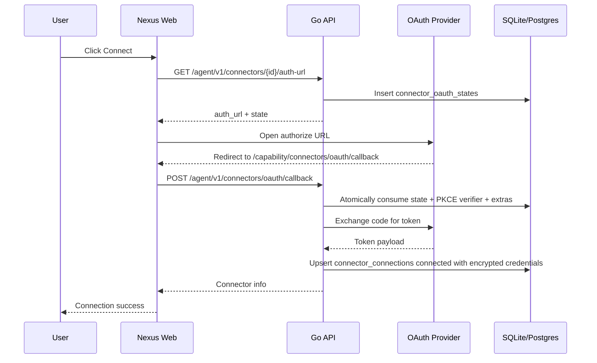

# Connector OAuth Spec

## Flow



## Provider Matrix

| Provider | Authorize URL | Token URL | Scopes | PKCE | Token auth | Extras |
| --- | --- | --- | --- | --- | --- | --- |
| GitHub | `https://github.com/login/oauth/authorize` | `https://github.com/login/oauth/access_token` | `repo read:user user:email` | No | form `client_secret` | none |
| Gmail | `https://accounts.google.com/o/oauth2/v2/auth` | `https://oauth2.googleapis.com/token` | `https://www.googleapis.com/auth/gmail.modify` | Yes | form `client_secret` | none |
| LinkedIn | `https://www.linkedin.com/oauth/v2/authorization` | `https://www.linkedin.com/oauth/v2/accessToken` | `openid profile email` | Yes | form `client_secret` | none |
| X / Twitter | `https://twitter.com/i/oauth2/authorize` | `https://api.twitter.com/2/oauth2/token` | `tweet.read users.read offline.access` | Yes | HTTP Basic Auth | none |
| Instagram | `https://www.instagram.com/oauth/authorize` | `https://api.instagram.com/oauth/access_token` | `instagram_business_basic` | No | form `client_secret` | none |
| Shopify | `https://{shop}.myshopify.com/admin/oauth/authorize` | `https://{shop}.myshopify.com/admin/oauth/access_token` | `read_products read_orders read_customers` | No | form `client_secret` | `shop` |

## Redirect URI Registration

Register this exact local callback URI in each provider developer portal:

```text
http://localhost:3000/capability/connectors/oauth/callback
```

GitHub: create an OAuth App under Developer settings and set Authorization callback URL.

Google: create a Web application OAuth client under APIs & Services, add the callback as an authorized redirect URI, and add the Gmail scope on the consent screen.

LinkedIn: create an app, enable "Sign In with LinkedIn using OpenID Connect", and add the callback on the Auth tab.

X / Twitter: enable OAuth 2.0 user authentication, choose Web App / confidential client, and add the callback URI.

Instagram: configure Instagram Login or Basic Display for a Business app and add the callback as a valid OAuth redirect URI.

Shopify: create a public app in the Partner dashboard and add the callback under allowed redirection URLs. Users enter only the shop subdomain, for example `nexus-dev`.

## Security Invariants

- OAuth state rows are consumed with `DELETE ... RETURNING` before token exchange, so the same state cannot be reused after the callback starts.
- State expires after `CONNECTOR_OAUTH_STATE_TTL_SECONDS`, default 600 seconds.
- Redirect URIs must match `CONNECTOR_OAUTH_ALLOWED_ORIGINS` by scheme, host, and path prefix. The default allows local web development at `http://localhost:3000`.
- Only provider-declared extra keys are persisted in `extra_json`; unknown query parameters are ignored.
- Connector credentials are encrypted with AES-GCM into `connector_connections.credentials_encrypted` when `CONNECTOR_CREDENTIALS_KEY` is configured. The key must be a 32-byte base64 value.

## Troubleshooting

- `OAuth state 无效或已过期`: the authorization attempt is missing, already used, or older than 10 minutes. Start Connect again.
- `redirect_uri_mismatch`: the URI passed to Nexus must exactly match the URI registered in the provider portal.
- `invalid_request` with PKCE providers: check that the provider supports S256 PKCE and that the callback is completing against the same Nexus backend that created the state.
- Shopify `shop 参数缺失`: enter the myshopify.com subdomain before opening the authorize page.
