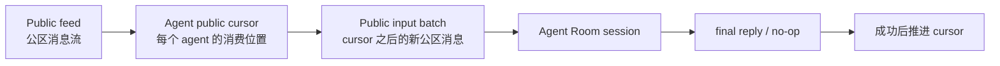

# Room 协作机制规格

## 1. 目标

Room 协作是多个 agent 在同一个共享空间里通信的内核机制。

它支持：

- 公区自然发言。
- 公区 `@成员` 触发目标 agent。
- Room 内私域消息。
- 单人或多人私域投递。
- 私域消息要求对方回复，并声明回复投递位置。
- 私域消息只记录，不要求回复。
- 延迟唤醒、排队、忙碌恢复和自动链路护栏。
- 可解释、可停止、可恢复的通信链路。

它不负责：

- 狼人杀、会议、投票、任务分配等业务规则。
- 判断某个业务动作是否合法。
- 替业务 skill 计算阶段、胜负、投票结果、发言顺序或讨论是否完成。
- 判断小范围讨论何时结束。
- 自动把控制权交还给主持人。

业务规则由 Room rule skill 和 agent 自己的决策承担。平台只负责通信、可见性、持久化、上下文、唤醒和护栏。

核心约束：

- 公区只有 `@成员` 一种唤醒语义。
- 私域只有 directed message 一种协议原语。
- 小范围讨论只是 directed message 的多人 recipients。
- “要求回答”和“回答到哪”是 directed message 的参数。
- 不要求回答的私信只是写入私域上下文。
- 平台不提供 marker、frame、request lifecycle 等业务流程原语。

## 2. 核心模型

### 2.1 Room

Room 是协作容器。

它包含：

- 成员。
- 一个或多个 conversation。
- Room 级配置。
- 当前启用的 rule skills。

Room 不代表一次业务流程。一次业务流程可能跨多个 conversation，也可能只是某个 conversation 里的业务上下文。

### 2.2 Conversation

Conversation 是 Room 内的一条共享对话。

公区消息、私域消息、运行时事件、唤醒队列和 checkpoint 都归属于某个 conversation。

Conversation 不包含平台解释的业务阶段、投票、任务状态或讨论完成状态。

### 2.3 Agent Room Session

每个 agent 在每个 Room conversation 中都有独立运行时 session。

它用于：

- 恢复模型历史。
- 保存该 agent 在当前 conversation 内的私有上下文。
- 绑定权限、工具和运行状态。

不同 conversation 的 session 互相隔离。

### 2.4 Public Feed

Public feed 是 Room 的公共事实层。

它只包含所有成员可见的内容：

- 用户公开消息。
- agent 公开最终回复。
- agent 通过受控工具主动发布的公开消息。
- 平台可公开展示的轻量状态事件。

它不包含：

- 私信正文。
- 私域回复。
- tool_use / thinking 过程。
- 未完成、取消或失败的中间输出。
- runtime result / no-op 等执行收尾记录。

Public feed 的唯一执行触发是 `@成员`。

任何进入 public feed 的文本，只要包含可解析的裸 `@成员`，都走统一公区唤醒规则。行内代码和 fenced code 中的 `@成员` 只是示例，不触发唤醒。唤醒属于 public feed + `@`，不属于某种特殊消息类型。

agent 主动发布公开消息使用内建工具 `nexus_room.publish_public_message`。这是写 public feed 的能力，不是 directed message，也不是 marker。它只表达“当前成员发布了一条公开消息”；平台不从中解释阶段、票型、胜负或业务状态。

### 2.5 Private Context

Private context 是某个 agent 在当前 Room conversation 中私下可见的上下文。

它可以包含：

- 其他 agent 发给它的 directed message。
- 多人 recipients directed message 中它可见的内容。
- 回复投影到它私域的结果。
- 它自己的私域记录。
- 它已消费上下文的 checkpoint。

Private context 不进入 public feed。

`private` 只表示“不进入 public feed”，不表示对 Room owner 或操作者不可见。产品上允许 owner / 操作者通过 inspector 查看 private context。

### 2.6 Directed Message

Directed message 是 Room 私域通信的唯一协议原语。

字段：

- `recipients[]`：可见成员。单人私信和多人小范围讨论都用这个字段表达。
- `content`：消息正文。
- `wake_policy`：是否要求 recipients 处理，取值为 `none`、`immediate`、`delayed`。
- `reply_route`：recipient 被唤醒后的 final reply 投递位置，以及私域回复是否继续唤醒 route recipients；private route 可声明 handback 后的 `next_reply_route`。
- `delay_seconds`：延迟唤醒参数，只在 `wake_policy=delayed` 时有效。
- `correlation_id`：可选、不透明的关联 id，用于观测和 UI 分组，不驱动流程。

平台绑定字段：

- 当前 Room。
- 当前 conversation。
- source agent。
- root round。
- caused-by round。
- owner user。
- 创建时间。

agent 不能自行伪造平台绑定字段。

其中 `Room`、`conversation`、`source agent` 和创建时间属于 directed message 记录本身；`root round`、`caused-by round`、`owner user` 属于调度与唤醒链路的 SoT。它们可以通过 active round、input queue、wake event、history cursor 等运行时记录关联回 message，但不要求冗余写入每条 directed message 记录。这样消息记录保持纯投递事实，调度状态仍由调度层负责。

Directed message 的语义只由三个参数决定：

- `recipients[]` 决定谁能看到。
- `wake_policy` 决定是否以及何时唤醒。
- `reply_route` 决定对方 final reply 到哪里，以及私域回复是否触发后续处理。

Directed message 没有 `kind`。

所谓“私信”“请求回复”“私有笔记”“小范围讨论”“记录”都只是 directed message 的不同参数组合，不是新协议原语。

常见组合：

| 用法 | 参数 |
| --- | --- |
| 只留私信 | `recipients=[target]`，`wake_policy=none`，`reply_route=none` |
| 要求对方公开回答 | `recipients=[target]`，`wake_policy=immediate|delayed`，`reply_route=public` |
| 要求对方私下回复发起者并继续推进 | `recipients=[target]`，`wake_policy=immediate|delayed`，`reply_route=private([source], wake=immediate)` |
| 要求对方私下回复指定成员并继续推进 | `recipients=[target]`，`wake_policy=immediate|delayed`，`reply_route=private([...], wake=immediate)` |
| 要求对方私下回复主持人，主持人随后公开推进 | `recipients=[target]`，`wake_policy=immediate|delayed`，`reply_route=private([host], wake=immediate, next_reply_route=public)` |
| 要求对方私下回复但只归档 | `recipients=[target]`，`wake_policy=immediate|delayed`，`reply_route=private([...], wake=none)` |
| 自己记一条私域记录 | `recipients=[self]`，`wake_policy=none`，`reply_route=none` |
| 小范围讨论 | `recipients=[a,b,c]`，`wake_policy=immediate|delayed|none`，`reply_route` 由业务 skill 指定 |

### 2.7 Reply Route

`reply_route` 决定由 directed message 唤醒的 recipient 在本轮 final reply 完成后，结果投递到哪里。

取值：

- `public`：写入 public feed。
- `private(recipients[], wake=immediate|none, next_reply_route?)`：写入指定成员 private context，并按 wake 参数决定是否唤醒这些成员。
- `none`：不投递本轮 final reply。

`reply_route` 不使用 `sender_private`、`target_private`、`audience` 这类派生枚举。发给谁必须显式写进 `private(recipients[], wake=...)`。

`reply_route=private([...], wake=immediate)` 会把 final reply 物化为一条新的 directed message，并唤醒 route recipients。这个能力用于明确的“把结果交回给某人继续处理”。

`next_reply_route` 只挂在 `private(..., wake=immediate)` 上，表示 route recipients 被这条私域 handback 唤醒后，他们本轮 final reply 的投影路线。缺省为 `none`。例如 `private([host], wake=immediate, next_reply_route=public)` 表示玩家私下回复 host，host 被唤醒后可以直接自然输出公区公告。

`reply_route=private([...], wake=none)` 只写入 route recipients 的 private context，不触发后续 round。这个能力用于私下归档或稍后查看。

`reply_route=private([...], wake=...)` 可以包含 source、原 target、其他成员或多人。

### 2.8 Correlation ID

`correlation_id` 是可选的不透明字符串。

它用于：

- 把一组 public message、directed message、wake 和 projection 在 UI 或日志中串起来。
- 帮助用户理解一次业务活动里发生过哪些通信动作。

它不用于：

- 判断阶段开始或结束。
- 判断请求 pending / resolved / cancelled。
- 判断投票、任务、讨论或发言顺序是否完成。
- 驱动自动唤醒或主持人回收。

如果业务 skill 需要阶段、投票、顺序或讨论完成状态，应在 skill 自己的业务状态中维护。

## 3. 公区协作机制

公区是自然聊天机制，不要求 agent 为普通公开发言调用工具。

公区机制的核心是：

公区消息是事实源。队列、引导和打断只决定“什么时候处理”，不改变公区事实。

### 3.1 普通公开回复

agent 被公区消息唤醒后，可以直接输出 final assistant reply。

默认情况下，这条 final reply 进入 public feed。

### 3.2 公区 `@` 唤醒

公区里的 `@成员名` 是执行触发，不是普通提及。

规则：

- 用户公开消息里的 `@成员名` 可以唤醒目标 agent。
- agent 公开 final reply 里的 `@成员名` 可以在当前 round 结束后唤醒目标 agent。
- 行内代码和 fenced code 中的 `@成员名` 不触发唤醒，用于格式示例。
- 只有明确转交、请求行动、要求对方公开回复时才使用 `@`。
- 描述计划、流程、顺序、未来轮到谁时，不使用 `@`。
- 回报结果、确认收到、总结状态时，不反向 `@` 发起者。
- 多个 `@` 表示并行唤醒多个成员；是否应该这样做由发言者或业务 skill 决定。

### 3.3 无需回复

agent 被唤醒后可以判断自己无需回复。

此时 agent 输出约定的 no-op 标记。平台识别后：

- 不写入 public feed。
- 可以根据是否已消费上下文决定是否写 checkpoint。
- 前端可展示轻量状态，而不是一条公开回复。

### 3.4 公区链路调度

agent final reply 中产生的公区 `@` 不应该在同一个模型执行循环中无限嵌套。

默认调度策略：

- source round 结束后再调度 target wake。
- 不打断 source round。
- 不复用 source agent 的运行时 session。
- 保留 root round 和 caused-by 关系。
- 受自动链路护栏限制。

### 3.5 公区输入批次

目标 agent 被唤醒时，平台不应每次发送完整公区快照。

平台应读取该 agent 的 public cursor，并把 cursor 之后的新公区消息作为一次输入批次发送给它。

输入批次包括：

- cursor 之后的 public feed 消息。
- latest trigger。
- 必要的 room / member 元数据。
- 必要的 private delta。

输入批次不包括：

- 目标无权查看的私域消息。
- 其他 agent 的 thinking / tool_use。
- 已被当前 agent 消费过且无需重放的旧公区消息。

### 3.6 队列、引导和打断

如果目标 agent 正在运行，新输入有三种处理方式：

- `queue`：排队，目标空闲后再处理。
- `guide`：作为引导注入当前 running round。
- `interrupt`：取消当前 round，立即启动新 round。

这些是运行时投递策略，不是业务协议原语。

## 4. 私域消息机制

私域消息必须走 directed message。

平台不从自然语言里猜私信、请求、笔记、阶段或讨论完成。

### 4.1 只记录

只记录表示写入 recipients 的 private context，但不唤醒任何人。

参数：

- `recipients[]` 非空。
- `wake_policy=none`。
- `reply_route=none`。

适用于：

- 同步身份、背景、规则。
- 给某个 agent 留私有上下文。
- 给多人小范围同步信息。
- agent 自己记录后续需要参考的私域信息。

### 4.2 要求回答

要求回答表示写入 recipients 的 private context，并按 `wake_policy` 唤醒 recipients。

参数：

- `recipients[]` 非空。
- `wake_policy=immediate|delayed`。
- `reply_route=public|private([...], wake=immediate|none, next_reply_route?)|none`。

`reply_route=none` 表示 recipient 可以处理本次唤醒，但 final reply 不投影给任何成员。除非业务 skill 明确需要这种静默处理，否则应优先使用 `public` 或 `private([...], wake=...)`。

### 4.3 小范围讨论

小范围讨论就是 `recipients[]` 包含多个成员的 directed message。

平台只保证：

- 每个 recipient 能看到同一条私域消息。
- 被唤醒的 recipient 按自己的 Room session 执行。
- recipient 的 final reply 按 `reply_route` 投影。
- 忙碌、延迟和恢复走统一 wake queue。

平台不保证：

- 谁先发言。
- 谁汇总。
- 讨论何时结束。
- 讨论结果是否正确。
- 是否应该交还主持人。

如果需要“讨论结束后继续推进”，业务 skill 必须显式指定：

- 哪个成员负责汇总。
- 汇总结果投递给谁。
- 汇总使用 `reply_route=private([host], wake=immediate)`、`reply_route=private([host], wake=immediate, next_reply_route=public)` 还是 `reply_route=public`。
- 没有汇总时如何超时或人工介入。

### 4.4 私域转公开

私域消息本身不会泄漏到 public feed。

有两种显式方式可以写入 public feed：

- recipient 的 final reply 使用 `reply_route=public`。
- private handback 使用 `next_reply_route=public` 唤醒 route recipient 后，该 recipient 的 final reply 进入 public feed。
- 当前 agent 调用内建工具 `nexus_room.publish_public_message` 主动发布公开消息。

平台必须保证：

- 原始私域 content 不自动进入 public feed。
- action / tool result 不自动进入 public feed；只有 `nexus_room.publish_public_message` 的 `content` 是公开消息正文。
- 公开回复进入 public feed 后，如果包含 `@成员`，再走统一公区 `@` 唤醒规则。

### 4.5 私域转私域

`reply_route=private([...], wake=...)` 会把 recipient 的 final reply 写入指定成员的 private context。

如果 route 的 `wake=immediate`，平台会为 route recipients 创建后续 wake，并把 `next_reply_route` 作为该 wake 的本轮 reply route；未声明时默认为 `none`。如果 route 的 `wake=none`，平台只写入 private context，不能声明 `next_reply_route`。

这仍然是私域投递，不进入 public feed。

## 5. Visible Context

Visible context 是平台传给 target agent 的可见输入。

它必须表达：

- 当前 public anchor。
- 当前 public delta。
- 当前 private delta。
- latest trigger。
- 本轮 reply_route。
- 必要的 checkpoint。

它不能混入：

- 目标无权查看的私域消息。
- 业务流程状态的伪真相源。
- 平台未验证的阶段、投票或讨论完成判断。

### 5.1 Public Anchor

Public anchor 是用于压缩上下文的稳定公区摘要或锚点。

它可以来自：

- 最近 N 条公区消息。
- 已确认的 public summary。
- 当前 conversation 元数据。

Public anchor 不替代 public feed source of truth。

### 5.2 Public Delta

Public delta 是当前 agent public cursor 之后的新公区消息。

它可以包含：

- 用户公开消息。
- agent 公开 final reply。
- 平台公开状态事件。

Public delta 不包含私域消息。

### 5.3 Private Delta

Private delta 是当前 agent 上次 checkpoint 之后的新私域内容。

它只包含当前 target agent 可见的 private context。

### 5.4 Latest Trigger

Latest trigger 解释“为什么这个 agent 现在被唤醒”和“本轮回复应该投到哪里”。

常见来源：

- 用户公区 `@`。
- agent 公区 final reply 中的 `@`。
- directed message immediate wake。
- directed message delayed wake 到期。
- 系统恢复 pending wake。
- 用户手动推进排队项。

Latest trigger 必须独立于 public delta 和 private delta。

Latest trigger 至少包含：

- trigger source。
- trigger content 或引用。
- trigger type。
- reply_route。
- root round。
- caused-by round。
- 可选 correlation_id。

### 5.5 Checkpoint

Checkpoint 表示某个 agent 已经消费到的 public / private 上下文位置。

规则：

- 成功完成的 round 可以推进 checkpoint。
- no-op 也可以推进 checkpoint。
- 被取消或失败的 round 不应推进 checkpoint，除非平台能证明输入已安全消费。
- checkpoint 是上下文构造机制，不是业务流程状态。

## 6. Projection Policy

Projection policy 决定 final assistant reply 投递到哪里。

规则：

- 公区 `@` 触发的 final assistant reply 默认进入 public feed。
- directed message 触发的 final assistant reply 按 `reply_route` 投递。
- `reply_route=public` 写入 public feed。
- `reply_route=private([...], wake=immediate)` 写入指定成员 private context，并唤醒 route recipients。
- `reply_route=private([...], wake=immediate, next_reply_route=...)` 唤醒 route recipients 时携带下一跳 reply route。
- `reply_route=private([...], wake=none)` 写入指定成员 private context，不唤醒 route recipients。
- `reply_route=none` 不投递 final reply。
- no-op final reply 不进入 public feed。
- action / tool result 只返回给当前 source agent，不自动成为 public message。

这条规则是防止私域内容泄露的核心边界。

## 7. 持久化机制

Room 协作有两类 source of truth。

### 7.1 消息与上下文 source of truth

用于表达“谁能看到什么”。

包括：

- Room public history。
- directed message store。
- agent private context。
- transcript reference。
- runtime session id。
- public cursor。
- private cursor。
- checkpoint。

它们适合做上下文构造、历史展示和 private inspector。

### 7.2 调度与队列 source of truth

用于表达“谁需要在什么时候被唤醒、能否恢复、能否取消、是否超限”。

需要覆盖：

- active round。
- input queue。
- wake scheduled。
- wake queued。
- wake running。
- wake skipped。
- wake blocked。
- projection completed。
- context checkpoint。
- guardrail counters。

调度与队列 source of truth 不表达业务 request lifecycle。

平台不维护 request pending / resolved / cancelled 作为协议状态。业务 skill 如需这类状态，应在自己的业务状态中维护，并通过普通公区消息或私域消息告知相关成员。

### 7.3 Append-only 记录

第一阶段可以继续使用 append-only JSONL 记录 directed message、wake、projection 和 checkpoint。

JSONL 是真相源，内存索引只是缓存。

需要依赖 JSONL 的能力：

- delayed wake 重启恢复。
- pending wake 跨刷新可见。
- root round 派生 wake 查询和取消。
- hop guard。
- 重复 wake 去重。
- 限流。

## 8. 协作事件与可观测性

协作事件用于前端展示和调试，不替代消息持久化和队列真相源。

事件应表达：

- message id。
- source agent。
- recipients。
- reply_route。
- wake_policy。
- wake 状态。
- root round。
- caused-by round。
- public message id。
- private message ids。
- projection result。
- checkpoint result。
- 可选 correlation_id。
- 被拦截原因。

常见事件类型：

- directed message 已投递。
- wake 已安排。
- wake 已排队。
- wake 已启动。
- wake 被跳过。
- wake 被护栏拦截。
- checkpoint 已写入。
- projection 已完成。

可观测性可以按 `correlation_id` 分组展示，但不能把分组解释成平台协议状态。

前端可以提供“通信链路视图”，展示某个 correlation 下发生过哪些 message、wake 和 projection。它不是 Frame / Request 状态机。

## 9. Wake 机制

### 9.1 不触发 round

以下动作默认只落盘：

- 没有 `@` 的普通公开消息。
- `wake_policy=none` 的 directed message。
- checkpoint。
- 运行时观测事件。

### 9.2 触发 round

以下情况可以唤醒目标 agent：

- 用户公区 `@`。
- agent 公区 final reply 中的 `@`。
- directed message `wake_policy=immediate`。
- directed message `wake_policy=delayed` 到期。
- 用户手动推进排队项。
- 系统恢复 pending wake。

### 9.3 自动链路护栏

自动 wake 必须有通用护栏：

- 单 root round 最大 hop。
- 单 root round 最大 wake 数量。
- 单 agent 并发上限。
- 单 conversation 并发上限。
- source 到 target 的短时间重复 wake 去重。
- 用户可停止当前自动链路。
- root round 停止时收口派生 pending wake。

护栏是平台运行时约束，不是业务规则。

## 10. 前端交互机制

### 10.1 Public Feed

Public feed 展示：

- 用户公开消息。
- agent 公开 final reply。
- 可公开的轻量状态事件。

Public feed 不展示：

- directed message 私域正文。
- private projection 正文。
- thinking / tool_use。
- 中间流式内容失败后残留。

### 10.2 Composer

Composer 支持两类发送：

- 公开消息。
- directed message。

公开消息：

- 默认进入 public feed。
- `@成员` 是唯一公开唤醒语义。

Directed message：

- 必须选择 recipients。
- 可以选择 `wake_policy`。
- 可以选择 `reply_route`。
- 可以填写可选 `correlation_id`。

### 10.3 Thread

Thread 用于解释一次通信链路。

它可以展示：

- root round。
- caused-by round。
- latest trigger。
- visible context 摘要。
- reply_route。
- wake 链路。
- projection 结果。

Thread 不展示业务 request lifecycle，除非该状态来自业务 skill 自己的公开输出或私域消息。

### 10.4 Member Panel

成员面板展示：

- 成员状态。
- 当前是否 running。
- 当前 input queue。
- 最近 checkpoint。
- 是否有 private context。
- 最近 directed message 摘要。
- pending wake 数量。

### 10.5 Private Inspector

Private inspector 用于 owner / 操作者查看 agent private context。

它必须明确区分：

- public feed。
- 当前 agent private context。
- directed message 投递记录。
- projection 结果。
- checkpoint。

### 10.6 通信链路视图

通信链路视图用于解释平台通信行为。

它可以按 conversation、root round、message id 或 `correlation_id` 过滤。

它展示：

- directed message 投递。
- wake scheduled / queued / running / skipped / blocked。
- projection completed。
- checkpoint。

它不展示平台解释出来的 frame、request pending、request resolved、投票状态、阶段状态或讨论完成状态。

## 11. 典型机制映射

### 11.1 开场排序

开场排序是业务 skill 的规则。

推荐机制：

- skill 在公区说明顺序。
- skill 用公区 `@` 唤醒当前应发言成员。
- 当前成员完成后，由 skill 或已被授权的协调 agent 决定下一位。

平台不计算顺序，也不判断顺序是否结束。

### 11.2 私发身份

推荐机制：

- 给每个目标 agent 发送 directed message。
- `recipients=[target]`。
- `wake_policy=none` 或按业务需要设为 `immediate`。
- `reply_route=none`。

目标 agent 后续被唤醒时，从 private delta 中看到身份。

### 11.3 顺序发言

顺序发言不是平台原语。

推荐机制：

- 业务 skill 维护顺序。
- 公区发言用 `@` 唤醒当前成员。
- 私域发言用 directed message 唤醒当前成员。
- 成员完成后，业务 skill 决定是否继续。

### 11.4 私聊后公开回复

推荐机制：

- source agent 发 directed message 给 target agent。
- `recipients=[target]`。
- `wake_policy=immediate|delayed`。
- `reply_route=public`。

target final reply 投影到 public feed。原始私域消息不进入 public feed。

### 11.5 私聊后私下回复

推荐机制：

- source agent 发 directed message 给 target agent。
- `recipients=[target]`。
- `wake_policy=immediate|delayed`。
- `reply_route=private([source], wake=immediate)` 或 `reply_route=private([...], wake=immediate)`。
- 如果 source 被唤醒后的 natural final reply 要进入 public feed，添加 `next_reply_route=public`。

target final reply 写入指定成员 private context。

### 11.6 小范围讨论和收集

小范围讨论和收集不是平台 workflow。

推荐机制：

- 业务 skill 选择讨论成员。
- 业务 skill 明确谁负责汇总。
- 平台发送 directed message，`recipients=[...]`。
- 如果需要立即讨论，使用 `wake_policy=immediate`。
- 如果需要稍后处理，使用 `wake_policy=delayed`。
- 如果需要把结果交回主持人，汇总者使用 `reply_route=private([host], wake=immediate)`。
- 如果主持人拿到结果后应直接公开推进，汇总者使用 `reply_route=private([host], wake=immediate, next_reply_route=public)`。
- 如果需要公开结论，汇总者使用 `reply_route=public`。

平台只投递、唤醒和投影。平台不判断收集是否完成，也不自动唤醒主持人。

狼人杀夜晚讨论示例：

- 上帝给狼人组发送 directed message。
- `recipients=[wolf_a,wolf_b,wolf_c]`。
- 消息内容明确“由 wolf_a 汇总”。
- `wake_policy=immediate`。
- `reply_route=private([host], wake=immediate)`。

讨论是否充分、谁投票、谁出局，都是狼人杀 skill 的业务规则。

### 11.7 记录

记录不是独立协议原语。

公开记录就是普通 public message，不带 `@` 时不会唤醒任何成员。

私域记录就是 directed message：

- `recipients=[self]` 或指定成员。
- `wake_policy=none`。
- `reply_route=none`。

## 12. 实施阶段

### Phase 1：规格收敛

目标：

- 将 Room 协议收敛为 public feed + directed message。
- 删除 marker、coordination frame、request lifecycle 的协议地位。
- 将 `audience` 降级为 `recipients[]` 的多人场景。
- 将 `sender_private`、`target_private`、`audience` 收敛为 `reply_route=private([...], wake=...)`。
- 明确 `correlation_id` 只是可选观测字段。

### Phase 2：兼容模型

目标：

- 在服务层引入 directed message 内部模型。
- 兼容读取旧 action 类型。
- 对外 prompt 和 CLI 不再鼓励使用 `marker`、`private_note`、`request_reply` 等旧原语。
- 旧枚举只作为迁移兼容层，不作为新协议设计依据。

### Phase 3：投影路由收敛

目标：

- 使用统一 `reply_route` 表达 public / private / none。
- 回复到私域时显式写入 private recipients 和 route wake 行为。
- 小范围讨论结果回交主持人由 skill 指定 route，不由平台推断。
- 确保私域 content 不因投影泄漏到 public feed。

### Phase 4：wake queue 收敛

目标：

- wake queue 只处理 immediate、delayed、queued、busy、recovery。
- 不维护 request pending / resolved / cancelled 业务状态。
- 公区唤醒只由 public feed `@` 触发。
- 私域唤醒只由 directed message `wake_policy` 触发。

### Phase 5：前端和观测收敛

目标：

- Composer 暴露公开消息和 directed message。
- Private inspector 展示 private context 和 directed message。
- 通信链路视图展示 message / wake / projection / checkpoint。
- 不再提供平台级 Frame / Request 状态机 UI。

## 13. 非目标

第一轮不做：

- 联系人 DM action。
- Connector 协作。
- SQL 协作动作表。
- 狼人杀专用字段。
- 会议专用流程。
- 投票专用表。
- 公共 summary 自动生成。
- 多用户权限细分。
- conversation 级 rule skill 覆盖。
- 平台级 frame / request lifecycle。

## 14. 总结

Room 协作不是业务流程引擎。

它是一套通用通信内核：

- 公区自然聊天。
- 公区 `@` 触发公开协作。
- 私域 directed message 负责单人私信、小范围讨论、要求回答和只记录。
- `reply_route` 决定 final reply 投到 public、private recipients 还是 nowhere，并声明私域回复是否继续唤醒 route recipients；`next_reply_route` 只表达 private handback 唤醒后的下一跳回复路线。
- visible context 决定 agent 看见什么。
- wake queue 决定什么时候运行。
- guardrail 限制自动链路。
- skill 负责业务规则，平台只负责边界和运行时。
