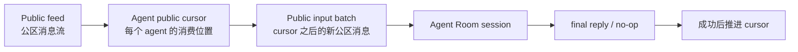
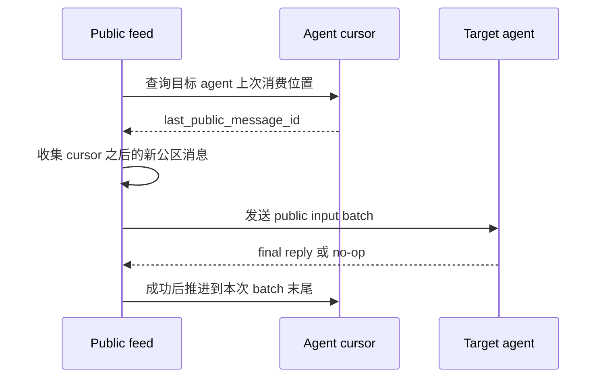
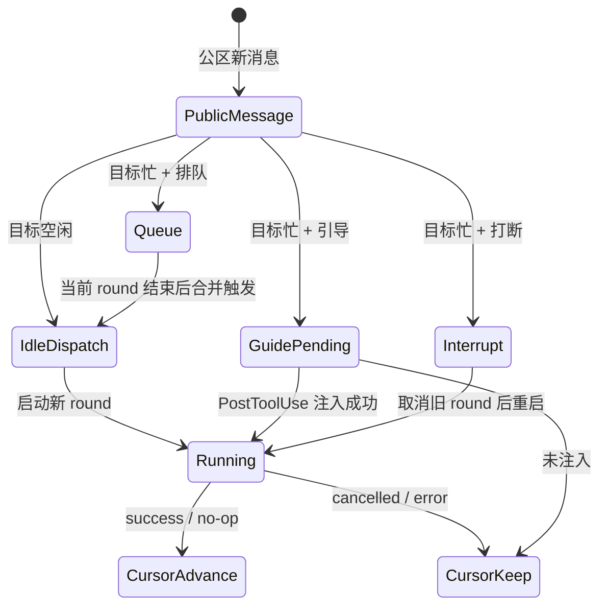

# Room 协作机制规格

## 1. 目标

Room 协作是一套让多个 agent 在同一个共享空间中协同工作的通用机制。

它需要支持：

- 公区自然发言。
- 公区 `@成员` 触发目标 agent。
- Room 内私信。
- 请求指定 agent 回复。
- 私密受众组。
- 协作标记和阶段记录。
- 延迟唤醒和手动推进。
- 可解释、可停止、可恢复的协作链路。

它不负责：

- 狼人杀、会议、投票、任务分配等业务规则。
- 判断某个业务动作是否合法。
- 替业务 skill 计算阶段、胜负、投票结果或发言顺序。

业务规则由 Room rule skill 和 agent 自己的决策承担。平台只负责通信、可见性、持久化、上下文、唤醒和护栏。

## 2. 核心模型

### 2.1 Room

Room 是协作容器。

它包含：

- 成员。
- 一个或多个 conversation。
- Room 级配置。
- 当前启用的 rule skills。

Room 不代表一次业务流程。一次业务流程可能跨多个 conversation，也可能只是一段 conversation 中的协作 frame。

### 2.2 Conversation

Conversation 是 Room 内的一条共享对话。

公区消息、私密消息、协作事件、request、wake 和 frame 都归属于某个 conversation。

### 2.3 Agent Room Session

每个 agent 在每个 Room conversation 中都有独立运行时 session。

它用于：

- 恢复模型历史。
- 保存该 agent 在当前 conversation 内的私有上下文。
- 绑定权限、工具和运行状态。

不同 conversation 的 session 互相隔离。

### 2.4 Public Feed

Public feed 是 Room 的公共事实层。

它只包含所有成员可见的内容：

- 用户公开消息。
- agent 公开最终回复。
- 公开 marker。
- 明确公开的 action 结果。

它不包含：

- 私信正文。
- 私密 request。
- 私密 reply。
- tool_use / thinking 过程。
- 未完成、取消或失败的中间输出。

### 2.5 Private Context

Private context 是某个 agent 在当前 Room conversation 中私下可见的上下文。

它可以包含：

- 其他 agent 发给它的私信。
- 请求它回复的 request。
- 它自己的私有笔记。
- 它所在私密受众组的消息。
- 它已消费上下文的 checkpoint。
- 投影结果和工具投递结果。

Private context 不进入 public feed。

`private` 只表示“不进入 public feed”，不表示对 Room owner 或操作者不可见。产品上允许 owner / 操作者通过 inspector 查看 private context。

### 2.6 Private Audience

Private audience 是 Room conversation 内的一组私密受众。

它不是新 Room，也不是联系人 DM。

同一条私密受众组消息会投递给多个目标 agent 的 private context，并带同一个 audience 标识。目标 agent 被唤醒时，可以看到自己所属 audience 的相关上下文。

### 2.7 Coordination Frame

Coordination frame 是一段协作活动的边界。

它可以表示：

- 一轮任务分配。
- 一次收集请求。
- 一段私密讨论。
- 一个阶段。
- 一个公开发言队列。
- 一次投票或评审。

平台不解释 frame 的业务含义。平台只负责把相关 public message、private message、request、reply、wake 和 marker 串起来。

## 3. 公区协作机制

公区是自然聊天机制，不要求 agent 为普通公开发言调用工具。

公区机制的核心是：

公区消息是事实源。队列、引导和打断只决定“什么时候处理”，不改变公区事实。

### 3.1 普通公开回复

agent 被公区消息唤醒后，可以直接输出 final assistant reply。

默认情况下，这条 final reply 进入 public feed。

### 3.2 公区 `@` 唤醒

公区里的 `@成员名` 是执行触发，不是普通提及。

规则：

- 用户公开消息里的 `@成员名` 可以唤醒目标 agent。
- agent 公开 final reply 里的 `@成员名` 可以在当前 round 结束后唤醒目标 agent。
- 只有明确转交、请求行动、要求对方公开回复时才使用 `@`。
- 描述计划、流程、顺序、未来轮到谁时，不使用 `@`。
- 回报结果、确认收到、总结状态时，不反向 `@` 发起者。

### 3.3 无需回复

agent 被唤醒后可以判断自己无需回复。

此时 agent 输出约定的 no-op 标记。平台识别后：

- 不写入 public feed。
- 可以根据是否已消费上下文决定是否写 checkpoint。
- 前端可展示轻量状态，而不是一条公开回复。

### 3.4 公区链路调度

agent final reply 中产生的公区 `@` 不应该在同一个模型执行循环中无限嵌套。

默认调度策略：

- source round 结束后再调度 target wake。
- 不打断 source round。
- 不复用 source agent 的运行时 session。
- 保留 root round 和 caused-by 关系。
- 受自动链路护栏限制。

### 3.5 公区输入批次

目标 agent 被唤醒时，平台不应每次发送完整公区快照。

平台应读取该 agent 的 public cursor，并把 cursor 之后的新公区消息作为一次输入批次发送给它。

示例：

推进规则：

- round 成功后推进 cursor。
- no-op 且确认已消费上下文后推进 cursor。
- cancelled / error 不推进 cursor。
- agent 自己刚产生的公开回复不需要在下一次输入里重复喂给自己。

### 3.6 队列、引导和打断

队列、引导和打断都围绕同一条 public feed 和同一个 agent cursor 工作。

规则：

- 公区消息先进入 public feed。
- 队列项只表示某个 agent 需要处理某个触发，不保存最终上下文。
- 目标空闲时，按 cursor 现算 public input batch。
- 目标忙且选择排队时，队列等目标空闲后再按 cursor 现算 batch。
- 多条排队触发可以合并成一次 batch，latest trigger 取最新触发。
- 目标忙且选择引导时，等待当前 round 的工具后置 hook 注入；注入成功才推进对应 cursor。
- 目标忙且选择打断时，取消旧 round，旧 round 不推进 cursor；新 round 按 cursor 重新读取 batch。

## 4. 私信与请求机制

私信、请求回复、私密受众组和 marker 不能靠自然语言解析。

这些必须走 Room Action。

Room Action 是系统级通信协议。它不是 Connector，不是 MCP 产品能力，也不是业务状态机。

### 4.1 Room Action 的通用要求

每个 action 必须绑定：

- 当前 Room。
- 当前 conversation。
- source agent。
- target agent 或 audience。
- root round。
- caused-by round。
- 可见性。
- reply target。
- request id。
- frame id。

source、Room、conversation、root round 等运行时身份必须由平台绑定，agent 不能自行伪造。

### 4.2 发送私信

发送私信只写入目标 agent 的 private context。

默认不触发目标 agent。

适用于：

- 同步身份、背景、顺序。
- 私下通知。
- 给某个 agent 留私有上下文。
- 给多个 agent 建立 private audience。

### 4.3 请求回复

请求回复是一条私密消息加回复契约。

它需要指定：

- 目标 agent。
- 请求内容。
- 回复位置。
- 唤醒策略。
- request id。
- 可选 frame id。

回复位置包括：

- 回复到 public feed。
- 私下回复给请求方。
- 私下回复给指定 agent。
- 只记录，不要求回复。

唤醒策略包括：

- 不唤醒，只落盘。
- 立即唤醒。
- 延迟唤醒，等待用户或协调 agent 推进。

延迟唤醒必须依赖可持久查询的 action source of truth。

### 4.4 私有笔记

agent 可以给自己写 private note。

它只进入当前 agent 的 private context，不触发任何 round。

### 4.5 协作标记

marker 用于记录协作事实。

它可以是公开的，也可以是私密的。

典型 marker：

- frame 开启。
- frame 关闭。
- 阶段变化。
- 发言顺序。
- 参与状态。
- 收集请求状态。
- 公开结论。

平台只保存和展示 marker，不解释 marker 的业务含义。

## 5. Visible Context

目标 agent 被唤醒时，平台需要为它构造本轮可见上下文。

Visible context 包含：

- 当前 Room 激活的 rule skill 名称。
- 成员目录。
- public anchor。
- public delta。
- private delta。
- private audience context。
- coordination frame context。
- latest trigger。

### 5.1 Public Anchor

Public anchor 是公共历史的压缩锚点。

第一阶段可以用有界公共历史快照代替。

后续可演进为公共事实摘要，但摘要不能包含私信、未完成输出或工具内部过程。

### 5.2 Public Delta

Public delta 是该 agent 上次消费公共上下文之后新增的公开事实。

它只包含：

- 已完成公开消息。
- 公开 marker。
- 用户公开指令。
- 明确公开的 action 结果。

它不包含：

- 未完成 stream。
- 取消或失败的中间回复。
- thinking / tool_use 过程。
- 私密消息。

### 5.3 Private Delta

Private delta 是该 agent 上次消费私有上下文之后新增的私有事实。

它只包含当前 target agent 可见的 private context。

### 5.4 Latest Trigger

Latest trigger 是本次唤醒的直接原因。

它可以来自：

- 用户公区 `@`。
- agent 公区 `@`。
- 私密 request reply。
- 手动唤醒。
- deferred request 推进。
- 系统恢复 pending wake。

Latest trigger 必须独立于 public delta 和 private delta。它解释“为什么这个 agent 现在被唤醒”和“应该回复到哪里”。

### 5.5 Checkpoint

Checkpoint 表示某个 agent 已经消费到的 public / private 上下文位置。

checkpoint 写入该 agent 的 private context。

写入时机：

- agent round 成功结束。
- agent no-op 但已消费上下文。

不写入时机：

- round 被取消。
- round 失败。
- 只投递私信但没有唤醒目标 agent。

checkpoint 不是业务状态，不进入 public feed。

## 6. Projection Policy

Projection policy 决定 final assistant reply 和 action 生成消息投递到哪里。

它必须早于私信和请求回复能力上线。

规则：

- 公区用户 `@` 触发的 final assistant reply 默认进入 public feed。
- 公区 agent `@` 触发的 final assistant reply 默认进入 public feed。
- 私密 request 如果 reply target 是 public，则 final reply 进入 public feed。
- 私密 request 如果 reply target 是 sender private，则 final reply 写入请求方 private context。
- 私密 request 如果 reply target 是指定 agent private，则 final reply 写入指定 agent private context。
- no-op final reply 不进入 public feed。
- action 的 tool result 只返回给当前 source agent，不自动成为 public message。
- 只有 action 本身声明公开投递时，才写 public feed。

这条规则是防止私聊内容泄露的核心边界。

## 7. 持久化机制

Room 协作有两类 source of truth。

### 7.1 消息与上下文 source of truth

用于表达“谁能看到什么”。

包括：

- Room public history。
- agent private context。
- transcript reference。
- runtime session id。
- round id。
- checkpoint。

它们适合做上下文构造和历史展示。

它们不适合做 wake queue、去重、限流和重启恢复。

### 7.2 调度与队列 source of truth

用于表达“谁在等谁、能否恢复、能否取消、是否超限”。

需要覆盖：

- request pending。
- request resolved。
- request cancelled。
- wake scheduled。
- wake blocked。
- wake skipped。
- marker recorded。
- projection result。
- context checkpoint。

第一阶段不新增 SQL 表，使用 append-only JSONL。

JSONL 是真相源，内存索引只是缓存。

需要依赖 JSONL 的能力：

- deferred request。
- pending wake 重启恢复。
- pending request 跨刷新可见。
- root round 派生 wake 停止收口。
- hop guard。
- 重复 wake 去重。
- 限流。

## 8. 协作事件

协作事件用于前端展示和调试，不替代消息持久化和 action JSONL。

事件应表达：

- action 类型。
- source agent。
- target agents。
- visibility。
- reply target。
- request id。
- frame id。
- root round。
- caused-by round。
- public message id。
- private message ids。
- wake 状态。
- 被拦截原因。

常见事件类型：

- 消息已投递。
- 请求待回复。
- 请求已解决。
- wake 已安排。
- wake 被跳过。
- wake 被护栏拦截。
- marker 已记录。
- checkpoint 已写入。
- projection 已完成。

## 9. Wake 机制

### 9.1 不触发 round

以下动作默认只落盘：

- 发送私信。
- 写私有笔记。
- 记录 marker。
- 没有 `@` 的普通公开消息。
- 不要求回复的 request。
- 延迟唤醒 request。

### 9.2 触发 round

以下情况可以唤醒目标 agent：

- 用户公区 `@`。
- agent 公区 final reply 中 `@`。
- immediate request reply。
- 用户手动唤醒。
- 用户或发起 agent 推进 deferred request。
- 系统恢复 pending wake。

### 9.3 自动链路护栏

自动 wake 必须有通用护栏：

- 单 root round 最大 hop。
- 单 root round 最大 wake 数量。
- 单 agent 并发上限。
- 单 conversation 并发上限。
- source 到 target 的短时间重复 wake 去重。
- 用户可停止当前自动链路。
- root round 停止时收口派生 pending wake。

护栏是平台运行时约束，不是业务规则。

## 10. 前端交互机制

前端不做新聊天系统，仍围绕 Room surface 扩展。

### 10.1 Public Feed

Public feed 只展示公开内容。

它可以展示：

- 用户公开消息。
- agent 公开回复。
- 公开 marker。
- wake 轻量状态。
- action 产生的公开消息。

它不展示私信正文。

### 10.2 Composer

Composer 支持：

- 公开发送。
- 私信。
- 请求回复。
- 手动唤醒。

请求回复需要选择：

- target agent。
- reply target。
- wake policy。

### 10.3 Thread

Thread 展示单个 agent round 的过程和调试信息。

它可以展示：

- latest trigger。
- visible context 摘要。
- tool / action 调用。
- action 投递结果。
- projection 结果。
- wake 链路。
- 权限和运行状态。

### 10.4 Member Panel

成员面板展示协作状态。

状态包括：

- idle。
- running。
- waiting reply。
- has private context。
- error。

可展示：

- 最近公开发言时间。
- 最近私信时间。
- 最近 checkpoint 时间。
- pending request 数量。
- 所属 private audience。
- 当前 frame 参与状态。

### 10.5 Private Inspector

Private inspector 用于 owner / 操作者查看 agent private context。

它和 public feed 分离。

默认协作视图只提示存在私密上下文，不展示正文。

### 10.6 Frame / Request View

Frame / request 视图用于解释协作链路。

它展示：

- frame label / kind / state。
- pending requests。
- resolved requests。
- private audience 数量。
- wake 状态。
- 可推进或可关闭的 request / frame。

它不硬编码业务阶段。

## 11. 典型机制映射

### 11.1 开场排序

排序是公开事实。

推荐机制：

- 记录公开 marker 或公开消息。
- 不默认唤醒所有 agent。
- 后续目标 agent 被唤醒时，从 public context 中看到排序。

### 11.2 私发身份

身份是私有事实。

推荐机制：

- 向目标 agent private context 写私信。
- 不默认唤醒。
- 目标 agent 后续被唤醒时从 private delta 中看到身份。

### 11.3 顺序发言

顺序发言是 deferred wake queue。

推荐机制：

- 用 marker 记录顺序。
- 唤醒当前发言者。
- 当前发言者完成后，由用户或协调 agent 推进下一位。

### 11.4 私聊后公开回复

推荐机制：

- source agent 发 request reply 给 target agent。
- reply target 设为 public。
- target final reply 投影到 public feed。
- 原始私信不进入 public feed。

### 11.5 私聊后私下回复

推荐机制：

- source agent 发 request reply 给 target agent。
- reply target 设为 sender private 或指定 agent private。
- target final reply 写入目标 private context。
- public feed 不展示正文。

### 11.6 收集型请求

收集型请求不是一次性广播唤醒所有人。

推荐机制：

- 打开 coordination frame。
- 向多个 agent 写 request。
- request 可以 immediate，也可以 deferred。
- 每个 agent 回复绑定 request id。
- 协调 agent 或用户汇总后公开 marker 或结论。

平台只跟踪 request 状态，不判断内容对错。

## 12. 实施阶段

### Phase 1：上下文与 checkpoint

目标：

- visible context 支持 public delta。
- visible context 支持 private delta。
- visible context 支持 latest trigger。
- 写入 context checkpoint。
- 普通 history 过滤控制行。
- 保留当前公区 `@` 协作。

### Phase 2：Projection-safe action

目标：

- 建立 Room action 机制。
- 支持私信。
- 支持 request reply。
- 支持 private note。
- 支持 marker。
- 支持 collaboration event。
- 同批完成 projection policy。
- 只开放 none / immediate wake。
- deferred 先不启用自动推进。

### Phase 3：Action JSONL

目标：

- 引入 action JSONL source of truth。
- 支持 request / wake / marker 状态查询。
- 支持 deferred request。
- 支持 root round 派生 wake 查询和取消。
- 支持启动重放。
- 支持 hop guard 和去重。

### Phase 4：前端协作 UI

目标：

- Composer 增加私信、请求回复和手动唤醒。
- Thread 展示 trigger、context、action、projection 和 wake。
- Member panel 展示协作状态。
- 增加 private inspector。
- 增加 frame / request view。

## 13. 非目标

第一轮不做：

- 联系人 DM action。
- Connector 协作。
- SQL 协作动作表。
- 狼人杀专用字段。
- 会议专用流程。
- 投票专用表。
- 公共 summary 自动生成。
- 多用户权限细分。
- conversation 级 rule skill 覆盖。

## 14. 总结

Room 协作不是业务流程引擎。

它是一套通用通信机制：

- 公区自然聊天。
- 公区 `@` 触发公开协作。
- 私信和请求走可审计 action。
- visible context 决定 agent 看见什么。
- projection policy 决定回复投到哪里。
- JSONL action store 承担可恢复调度状态。
- skill 负责业务规则，平台只负责边界和运行时。
